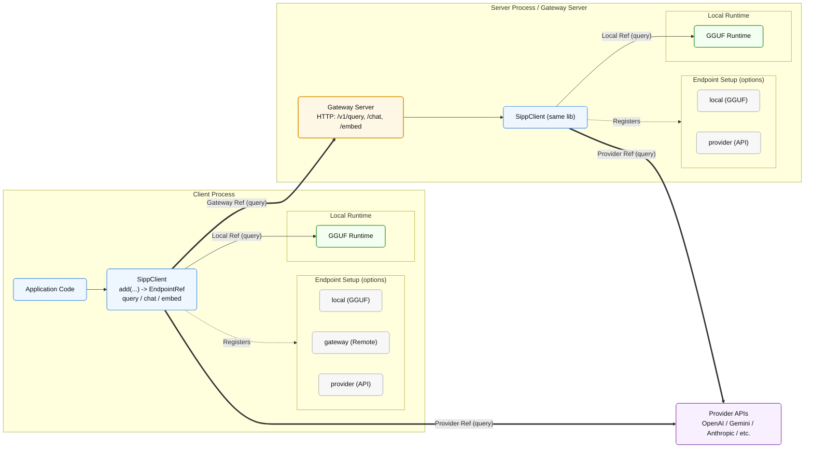

# Library API Overview

The Sipp libraries for Rust, Node.js, Python, and Browser expose the same
endpoint-oriented client model.

At a high level:

1. Register an endpoint with `add`.
2. Keep the returned `EndpointRef`.
3. Pass that reference to `query`, `chat`, or `embed`.

This keeps application code the same whether inference runs locally, through a
gateway, through a provider, or across a hybrid setup.

## Core Client Methods

`SippClient` exposes four primary methods:

| Method  | Purpose                                                                      |
| ------- | ---------------------------------------------------------------------------- |
| `add`   | Register a local, gateway, or provider endpoint and return an `EndpointRef`. |
| `query` | Generate text from a raw prompt string. No chat template is applied.         |
| `chat`  | Generate text from ordered `{ role, content }` messages.                     |
| `embed` | Generate an embedding vector from text input.                                |

## `add()` — Register an Endpoint

```text
add(id: string, descriptor: EndpointDescriptor) -> EndpointRef
```

`add` registers an endpoint with the current client instance.

The `id` is caller-defined and scoped to the client. Reusing an `id` replaces
the existing endpoint. The returned `EndpointRef` is a lightweight handle with:

| Field  | Description                                             |
| ------ | ------------------------------------------------------- |
| `kind` | Endpoint kind: `"local"`, `"gateway"`, or `"provider"`. |
| `id`   | The endpoint id registered on this client.              |

Pass the returned `EndpointRef` to `query`, `chat`, or `embed` to choose where
the operation runs.

### Local Endpoint

A local endpoint loads a GGUF model into the current process. The application
owns model selection, runtime lifecycle, and cleanup.

| Field       | Type                           | Description                                                                                                                                 |
| ----------- | ------------------------------ | ------------------------------------------------------------------------------------------------------------------------------------------- |
| `kind`      | `"local"`                      | Endpoint kind selector.                                                                                                                     |
| `modelPath` | string / `PathBuf`             | Filesystem path or browser URL for the GGUF artifact.                                                                                       |
| `config`    | `NativeRuntimeConfig` optional | Load-time runtime configuration, including context size, GPU placement, scheduler policy, cache mode, sampling defaults, and observability. |

Use a local endpoint when the current process should own model execution.

### Gateway Endpoint

A gateway endpoint sends requests to a remote Sipp gateway over HTTP. The
gateway process owns provider credentials, local model paths, access policy,
concurrency, and metrics.

| Field                         | Type                            | Description                                                                                        |
| ----------------------------- | ------------------------------- | -------------------------------------------------------------------------------------------------- |
| `kind`                        | `"gateway"`                     | Endpoint kind selector.                                                                            |
| `target`                      | string                          | Public target name resolved by the gateway. Sent as the `model` field in gateway profile requests. |
| `baseUrl`                     | string                          | Absolute HTTP(S) URL of the gateway service.                                                       |
| `authentication`              | `{ kind, value?, headerName? }` | Auth strategy: `"none"`, `"bearer"`, or `"header"`.                                                |
| `staticHeaders`               | `{ name, value }[]` optional    | Additional HTTP headers attached to every request.                                                 |
| `timeoutMs` / `timeoutPolicy` | number / struct optional        | Connection, request, and streaming read deadlines.                                                 |
| `queryRoute`                  | string optional                 | Query route. Defaults to `/v1/query`.                                                              |
| `chatRoute`                   | string optional                 | Chat route. Defaults to `/v1/chat`.                                                                |
| `embedRoute`                  | string optional                 | Embedding route. Defaults to `/v1/embed`.                                                          |
| `protocolOptions`             | map optional                    | Profile-specific options merged into every request body.                                           |

Use a gateway endpoint when a separate service should own model access and
operational policy.

### Provider Endpoint

A provider endpoint calls a model provider directly. This is intended for
trusted server-side code that manages its own credential lifecycle.

| Field      | Type                                               | Description                         |
| ---------- | -------------------------------------------------- | ----------------------------------- |
| `kind`     | `"provider"`                                       | Endpoint kind selector.             |
| `provider` | `"openai"` / `"anthropic"` / `"openai_compatible"` | Provider adapter.                   |
| `model`    | string                                             | Provider model identifier.          |
| `apiKey`   | string optional                                    | Provider API key.                   |
| `baseUrl`  | string optional                                    | Override for the provider base URL. |

Use a provider endpoint when server-side code should call a provider API
directly without a Sipp gateway.

---

## `query()` — Generate from a Raw Prompt

```text
query(request: SippQueryRequest) -> SippTextRun
```

`query` sends the prompt string to the selected endpoint exactly as supplied.
No chat template is applied.

Use `query` when the application owns the full prompt shape, including custom
templates, completion-style models, encoder-decoder text models, few-shot
prompts, or agent loops that render prompts themselves.

### Request Fields

| Field             | Type                         | Description                                                                                                                            |
| ----------------- | ---------------------------- | -------------------------------------------------------------------------------------------------------------------------------------- |
| `endpoint`        | `EndpointRef`                | Registered endpoint to target. May be omitted only when exactly one local endpoint supports the operation.                             |
| `prompt`          | string                       | Raw prompt text.                                                                                                                       |
| `options`         | `SippTextOptions` optional | Shared generation options: `maxTokens`, `temperature`, `topP`, and `stop`.                                                             |
| `local`           | `LocalTextOptions` optional  | Local-only options such as `contextKey`, `grammar`, `jsonSchema`, sampling overrides, and media inputs. Rejected by gateway endpoints. |
| `endpointOptions` | map optional                 | Free-form options forwarded to gateway endpoint implementations.                                                                       |
| `providerOptions` | map optional                 | Free-form options forwarded to direct provider adapters. Rejected by gateway endpoints.                                                |
| `emitTokens`      | boolean                      | When true, stream `TokenBatch` values through the returned run handle.                                                                 |

### Return Value

`query` returns a `SippTextRun`.

| Member           | Type             | Description                                                 |
| ---------------- | ---------------- | ----------------------------------------------------------- |
| `response`       | Promise / Future | Resolves to `SippTextResponse` when generation completes. |
| `tokens`         | Async iterable   | Streams `TokenBatch` values when `emitTokens` is true.      |
| `cancel(reason)` | method           | Cancels an in-flight generation.                            |

`SippTextResponse` contains the generated `text`, `finishReason`, token
`usage`, and optional `localStats` for local endpoints.

---

## `chat()` — Generate from Role Messages

```text
chat(request: SippChatRequest) -> SippTextRun
```

`chat` sends ordered role/content messages to the selected endpoint. The
endpoint owns message rendering.

| Endpoint kind | Message handling                                                                                          |
| ------------- | --------------------------------------------------------------------------------------------------------- |
| Local         | Renders messages through the GGUF-declared `tokenizer.chat_template`. Fails if the model has no template. |
| Gateway       | Forwards messages to the resolved gateway target. Provider targets handle their own message mapping.      |
| Provider      | Sends messages using the provider's native chat-completions format.                                       |

### Request Fields

| Field        | Type                  | Description                                |
| ------------ | --------------------- | ------------------------------------------ |
| `endpoint`   | `EndpointRef`         | Registered endpoint to target.             |
| `messages`   | `{ role, content }[]` | Ordered conversation turns.                |
| `options`    | `SippTextOptions`   | Same shared generation options as `query`. |
| `local`      | `LocalTextOptions`    | Same local-only options as `query`.        |
| `emitTokens` | boolean               | Same streaming control as `query`.         |

### Return Value

`chat` returns the same `SippTextRun` shape as `query`.

---

## `embed()` — Generate an Embedding

```text
embed(request: SippEmbedRequest) -> SippEmbeddingRun
```

`embed` produces a single embedding vector from text input. It does not accept
generation options and does not stream tokens.

### Request Fields

| Field             | Type                         | Description                                                      |
| ----------------- | ---------------------------- | ---------------------------------------------------------------- |
| `endpoint`        | `EndpointRef`                | Registered endpoint to target.                                   |
| `input`           | string                       | Text to vectorize.                                               |
| `local`           | `LocalEmbedOptions` optional | Local embedding options, including `contextKey` and `normalize`. |
| `endpointOptions` | map optional                 | Free-form options for gateway endpoint implementations.          |
| `providerOptions` | map optional                 | Free-form options for direct provider adapters.                  |

### Return Value

`embed` returns a `SippEmbeddingRun`.

| Member           | Type             | Description                                                    |
| ---------------- | ---------------- | -------------------------------------------------------------- |
| `response`       | Promise / Future | Resolves to `SippEmbeddingResponse` when encoding completes. |
| `cancel(reason)` | method           | Cancels an in-flight embedding.                                |

`SippEmbeddingResponse` contains the float `values` array, optional token
`usage`, the `pooling` strategy, and the `normalized` flag.

---

## Gateway and Client Symmetry

The same `SippClient` API works on both sides of the gateway boundary.

### Server Side

A server process creates a `SippClient`, registers local endpoints, and maps
HTTP routes to `query`, `chat`, or `embed`.

```text
Server client:
  add("local-model", LocalDescriptor { modelPath, config })
  -> route handler decodes HTTP request
  -> route handler calls client.query/chat/embed
  -> route handler encodes HTTP response
```

The first-party Gateway Server uses this pattern. Application-owned Node,
Python, or Rust servers can also use it through the gateway profile helpers.

### Client Side

A client process creates a `SippClient`, registers gateway endpoints, and
calls `query`, `chat`, or `embed` the same way it would call a local endpoint.

```text
Client client:
  add("remote", GatewayDescriptor { target, baseUrl, authentication })
  -> client.query/chat/embed({ endpoint: ref, ... })
  -> request is sent to the gateway over HTTP
```

### Hybrid Pattern

A single client can register multiple endpoint kinds. The application chooses
where an operation runs by passing a different endpoint reference.

```text
localRef = client.add("local", LocalDescriptor { ... })
gatewayRef = client.add("gateway", GatewayDescriptor { ... })

client.query({ endpoint: localRef, prompt, ... })
client.query({ endpoint: gatewayRef, prompt, ... })
```

The operation code stays the same. Only the endpoint reference changes.

## Why the Endpoint Model Matters

The endpoint model gives applications one API surface across multiple deployment
shapes.

| Benefit                     | Description                                                                                                                       |
| --------------------------- | --------------------------------------------------------------------------------------------------------------------------------- |
| Stable operation code       | `query`, `chat`, and `embed` are called the same way for local, gateway, provider, and hybrid setups.                             |
| Swappable execution targets | Move inference between local models, gateway targets, and direct providers by changing endpoint descriptors.                      |
| Clear ownership boundaries  | Local endpoints keep lifecycle in-process; gateway endpoints move access, credentials, policy, and metrics to a service boundary. |
| Language symmetry           | Patterns learned in one language package transfer directly to the others.                                                         |
| Extensible endpoint kinds   | New endpoint kinds can be added without changing the operation call pattern.                                                      |

## Visual Summary



## Related Docs

* [Using the Core Library](../packages) — per-language install steps and examples.
* [Inference Operations](../guides/inference-operations.md) — operation contracts, template behavior, and gateway target mapping.
* [Local Inference](../guides/local-inference.md) — model sources, runtime options, threads, and browser execution.
* [Gateway and Hybrid Inference](../guides/gateway-hybrid.md) — deployment shapes, endpoint model, and authentication patterns.
* [Runtime Options](../reference/runtime-options.md) — complete option layer map and field reference.
