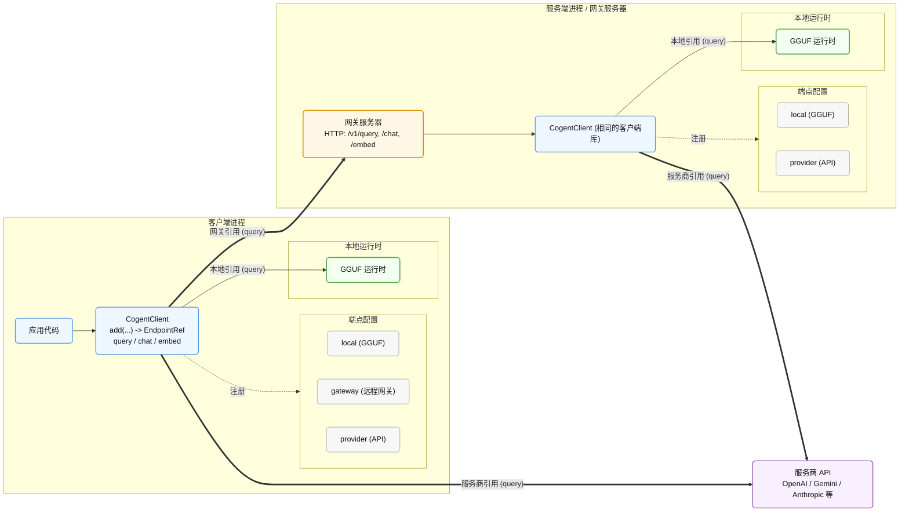

# API 概述

CogentLM 各语言包（Rust、Node.js、Python、浏览器）使用同一套面向端点的客户端模型。

核心流程：

1. 调用 `add` 注册端点。
2. 保存返回的 `EndpointRef`。
3. 将引用传入 `query`、`chat` 或 `embed`。

无论本地运行、通过网关、直连服务商还是混合模式，应用代码的调用方式完全一致。

## CogentClient使用方法

`CogentClient` 提供四个主要方法：

| 方法 | 作用 |
| ------- | ---------------------------------------------------------------------------- |
| `add` | 注册本地、网关或服务商端点，返回 `EndpointRef`。 |
| `query` | 传入一段提示词文本，生成回复。不套聊天模板。 |
| `chat` | 传入有序的 `{ role, content }` 消息列表，生成回复。 |
| `embed` | 传入文本，生成嵌入向量。 |

## `add()` — 注册端点

```text
add(id: string, descriptor: EndpointDescriptor) -> EndpointRef
```

`add` 将端点注册到当前客户端实例上。`id` 由调用方指定，在当前客户端内唯一。重复使用相同的 `id` 会覆盖之前的端点。返回的 `EndpointRef` 是一个句柄：

| 字段 | 说明 |
| ------ | ------------------------------------------------------- |
| `kind` | 端点类型：`"local"`、`"gateway"` 或 `"provider"`。 |
| `id` | 注册时用的 ID。 |

将返回的 `EndpointRef` 传入 `query`、`chat`、`embed`，决定请求的执行目标。

### 本地端点

本地端点将 GGUF 模型加载到当前进程中。应用全权负责模型选择、运行时生命周期管理和资源清理。

| 字段 | 类型 | 说明 |
| ----------- | ------------------------------ | ---------------------------------------------------------------------------------------------------------------------------------- |
| `kind` | `"local"` | 端点类型。 |
| `modelPath` | string / `PathBuf` | GGUF 文件的路径或浏览器 URL。 |
| `config` | `NativeRuntimeConfig`（可选） | 加载时的运行时配置，包括上下文大小、GPU 分配、调度策略、缓存模式、默认采样参数、可观测性等。 |

当前进程需要自行管理模型执行时使用本地端点。

### 网关端点

网关端点通过 HTTP 将请求发送至远程 CogentLM 网关。网关进程负责管理服务商凭证、本地模型路径、访问策略、并发和监控指标。

| 字段 | 类型 | 说明 |
| ----------------------------- | ------------------------------- | -------------------------------------------------------------------------------------------------- |
| `kind` | `"gateway"` | 端点类型。 |
| `target` | string | 网关能识别的公开目标名称，会作为 `model` 字段发到网关。 |
| `baseUrl` | string | 网关服务的 HTTP(S) 地址（绝对 URL）。 |
| `authentication` | `{ kind, value?, headerName? }` | 鉴权方式：`"none"`、`"bearer"` 或 `"header"`。 |
| `staticHeaders` | `{ name, value }[]`（可选） | 每次请求都会带上的额外 HTTP 头。 |
| `timeoutMs` / `timeoutPolicy` | number / struct（可选） | 连接、请求、流式读取的超时时间。 |
| `queryRoute` | string（可选） | query 路由，默认 `/v1/query`。 |
| `chatRoute` | string（可选） | chat 路由，默认 `/v1/chat`。 |
| `embedRoute` | string（可选） | embed 路由，默认 `/v1/embed`。 |
| `protocolOptions` | map（可选） | 合到每个请求体里的选项。 |

需要独立服务统一管理模型访问和运维策略时使用网关端点。

### 服务商端点

服务商端点直接调用模型服务商的 API。适用于在服务端自行管理凭证的可信代码。

| 字段 | 类型 | 说明 |
| ---------- | -------------------------------------------------- | ----------------------------------- |
| `kind` | `"provider"` | 端点类型。 |
| `provider` | `"openai"` / `"anthropic"` / `"openai_compatible"` | 服务商适配器。 |
| `model` | string | 服务商的模型 ID。 |
| `apiKey` | string（可选） | API 密钥。 |
| `baseUrl` | string（可选） | 覆盖服务商的默认地址。 |

服务端代码需要绕过 CogentLM 网关直接调用服务商 API 时使用服务商端点。

---

## `query()` — 传原始提示词生成文本

```text
query(request: CogentQueryRequest) -> CogentTextRun
```

`query` 将提示词字符串原样发送给目标端点，不应用聊天模板。

需要自行控制提示词格式时使用 `query`，适用于自定义模板、基础模型、编码器-解码器模型、少样本提示或自行构建提示词的智能体。

### 请求字段

| 字段 | 类型 | 说明 |
| ----------------- | ---------------------------- | ------------------------------------------------------------------------------------------------------------------------------------------ |
| `endpoint` | `EndpointRef` | 目标端点。客户端只有一个本地端点支持该操作时可以省略。 |
| `prompt` | string | 提示词文本。 |
| `options` | `CogentTextOptions`（可选） | 通用生成选项：`maxTokens`、`temperature`、`topP`、`stop`。 |
| `local` | `LocalTextOptions`（可选） | 仅限本地的选项：`contextKey`、`grammar`、`jsonSchema`、采样覆盖、多模态输入。网关端点会拒绝。 |
| `endpointOptions` | map（可选） | 透传给网关端点的自定义选项。 |
| `providerOptions` | map（可选） | 透传给服务商适配器的自定义选项。网关端点会拒绝。 |
| `emitTokens` | boolean | 设为 true 时，通过返回的句柄流式输出 `TokenBatch`。 |

### 返回值

`query` 返回 `CogentTextRun`。

| 成员 | 类型 | 说明 |
| ---------------- | ---------------- | ----------------------------------------------------------- |
| `response` | Promise / Future | 生成完成后解析为 `CogentTextResponse`。 |
| `tokens` | Async iterable | `emitTokens=true` 时异步产出 `TokenBatch`。 |
| `cancel(reason)` | 方法 | 取消正在进行的生成。 |

`CogentTextResponse` 包含生成的 `text`、结束原因 `finishReason`、Token 用量 `usage`，本地端点还会带 `localStats`。

---

## `chat()` — 传消息列表生成文本

```text
chat(request: CogentChatRequest) -> CogentTextRun
```

`chat` 将有序的角色/内容消息发送给目标端点，由端点处理消息渲染。

| 端点类型 | 消息处理方式 |
| ------------- | --------------------------------------------------------------------------------------------------------- |
| 本地 | 用 GGUF 声明的 `tokenizer.chat_template` 渲染消息。模型无模板时报错。 |
| 网关 | 将消息转发至网关的目标，服务商目标自行处理消息格式。 |
| 服务商 | 转成服务商原生的 chat-completions 格式发出去。 |

### 请求字段

| 字段 | 类型 | 说明 |
| ------------ | --------------------- | ------------------------------------------ |
| `endpoint` | `EndpointRef` | 目标端点。 |
| `messages` | `{ role, content }[]` | 有序的对话轮次。 |
| `options` | `CogentTextOptions` | 同 `query` 的生成选项。 |
| `local` | `LocalTextOptions` | 同 `query` 的本地选项。 |
| `emitTokens` | boolean | 同 `query` 的流式开关。 |

### 返回值

`chat` 返回与 `query` 相同的 `CogentTextRun`。

---

## `embed()` — 生成嵌入向量

```text
embed(request: CogentEmbedRequest) -> CogentEmbeddingRun
```

`embed` 将输入文本转换为嵌入向量。不支持生成选项，也不流式输出 Token。

### 请求字段

| 字段 | 类型 | 说明 |
| ----------------- | ---------------------------- | ---------------------------------------------------------------- |
| `endpoint` | `EndpointRef` | 目标端点。 |
| `input` | string | 要向量化的文本。 |
| `local` | `LocalEmbedOptions`（可选） | 仅限本地的选项：`contextKey`、`normalize`。 |
| `endpointOptions` | map（可选） | 透传给网关端点的自定义选项。 |
| `providerOptions` | map（可选） | 透传给服务商适配器的自定义选项。 |

### 返回值

`embed` 返回 `CogentEmbeddingRun`。

| 成员 | 类型 | 说明 |
| ---------------- | ---------------- | -------------------------------------------------------------- |
| `response` | Promise / Future | 编码完成后解析为 `CogentEmbeddingResponse`。 |
| `cancel(reason)` | 方法 | 取消正在进行的嵌入任务。 |

`CogentEmbeddingResponse` 包含浮点数数组 `values`、可选的 Token `usage`、池化策略 `pooling` 和归一化标志 `normalized`。

---

## 网关两端的 API 是对称的

同一套 `CogentClient` API 在网关两端均可使用。

### 服务端

服务端进程创建 `CogentClient`，注册本地端点，将 HTTP 路由映射至 `query`、`chat`、`embed`。

```text
服务端：
  add("local-model", LocalDescriptor { modelPath, config })
  -> 路由处理器解析 HTTP 请求
  -> 路由处理器调 client.query / chat / embed
  -> 路由处理器编码 HTTP 响应
```

官方网关服务器即采用此模式。Node、Python、Rust 服务端也可使用同样的模式，配合网关 profile 辅助函数。

### 客户端

客户端进程创建 `CogentClient`，注册网关端点，调用 `query`、`chat`、`embed` 的方式与调用本地端点完全相同。

```text
客户端：
  add("remote", GatewayDescriptor { target, baseUrl, authentication })
  -> client.query / chat / embed({ endpoint: ref, ... })
   -> 请求通过 HTTP 发送至网关
```

### 混合模式

同一个客户端可注册多种端点。传入不同的端点引用即可将请求发往不同的目标。

```text
localRef = client.add("local", LocalDescriptor { ... })
gatewayRef = client.add("gateway", GatewayDescriptor { ... })

client.query({ endpoint: localRef, prompt, ... })
client.query({ endpoint: gatewayRef, prompt, ... })
```

操作代码完全相同，仅端点引用不同。

## 为什么统一端点模型

端点模型使同一套 API 适用于各种部署方式。

| 优势 | 说明 |
| --------------------------- | --------------------------------------------------------------------------------------------------------------------------------- |
| 操作代码不变 | `query`、`chat`、`embed` 在本地、网关、服务商、混合模式下调用方式完全一致。 |
| 执行目标灵活切换 | 修改端点描述符即可在本地模型、网关目标和服务商之间切换。 |
| 职责边界清晰 | 本地端点生命周期在进程内；网关端点将访问控制、凭证、策略、指标隔离至服务边界之外。 |
| 跨语言一致 | 掌握一种语言包即可直接使用其他语言。 |
| 扩展性好 | 添加新端点类型无需修改调用方式。 |

## 架构概览



## 相关文档

* [使用核心库](../packages) — 各语言安装步骤和示例。
* [推理操作](../guides/inference-operations.md) — 接口约定、模板行为、网关目标映射。
* [本地推理](../guides/local-inference.md) — 模型来源、运行时选项、线程、浏览器执行。
* [网关与混合推理](../guides/gateway-hybrid.md) — 部署形态、端点模型、鉴权方式。
* [运行时选项](../reference/runtime-options.md) — 选项层级和字段说明。
