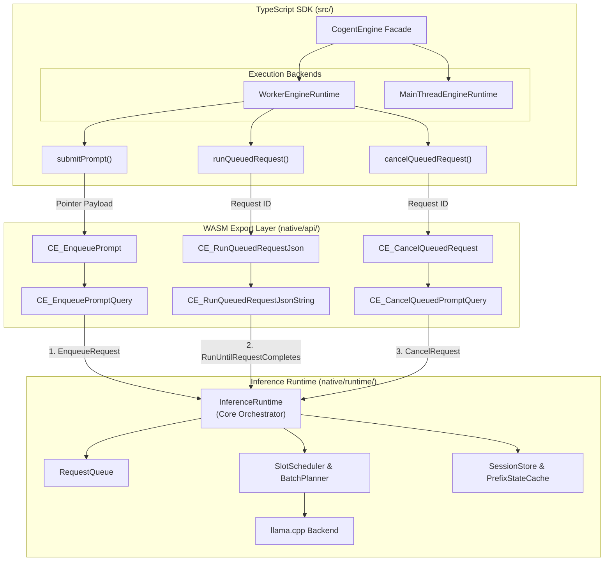
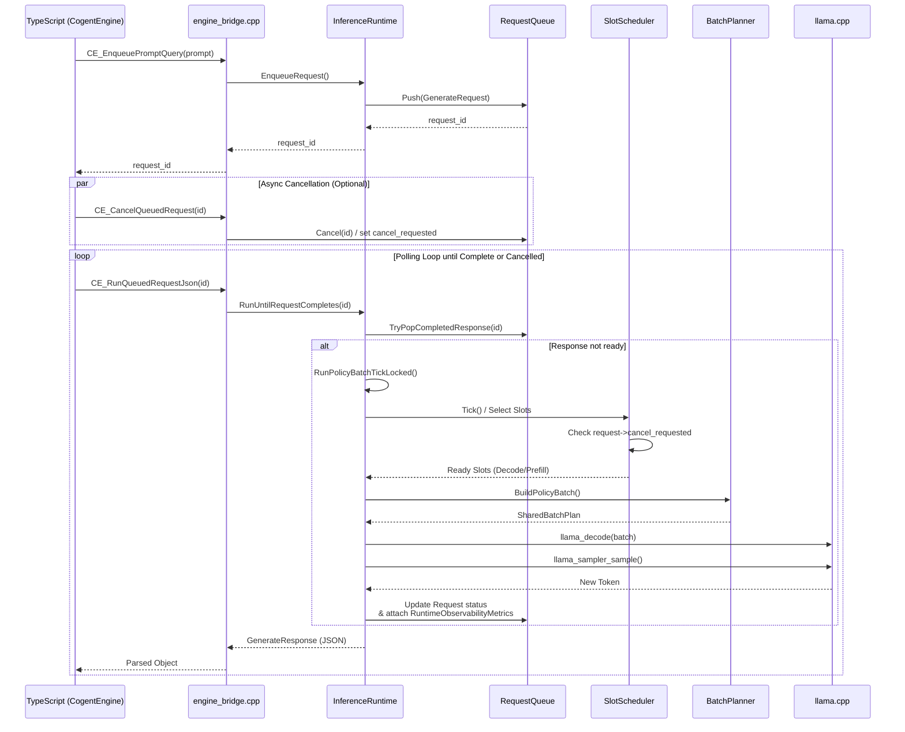
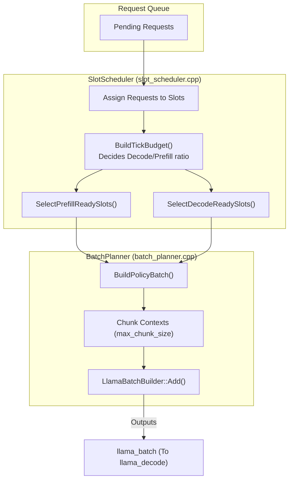
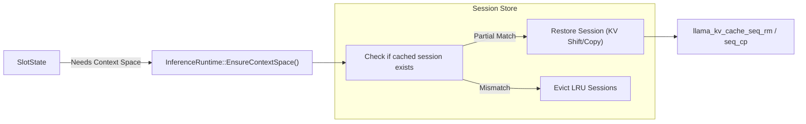
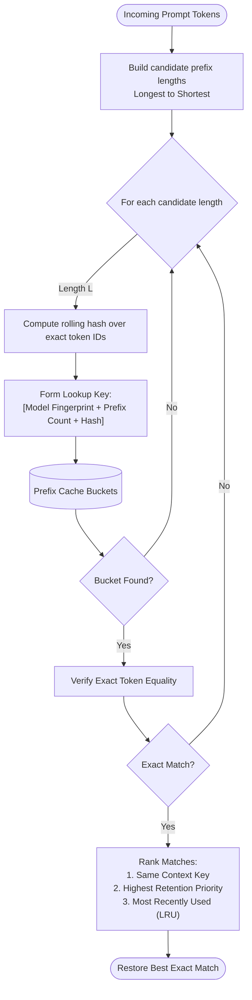
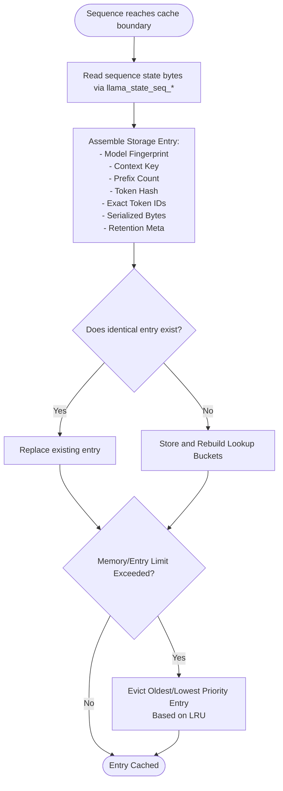

# CogentEngine Codebase Visualization

This document presents a comprehensive set of visualizations for the CogentEngine architecture using Mermaid diagrams. The visualizations are structured from the high-level system boundary down to the nuanced function calls of the native inference scheduler. 

## 1. High-Level System Architecture

This diagram illustrates how the frontend components (the TypeScript SDK and Web Worker) interface with the WebAssembly compilation of the C++ Native Runtime. 

---

## 2. Request Lifecycle & Execution Call Flow

When a prompt is enqueued, it doesn't execute immediately. It enters the `RequestQueue` and is polled by the TypeScript layer (typically via Asyncify or Web Workers polling the `generate` function). The engine tick then schedules, plans, and executes the batch.

---

## 3. Scheduler & Batching Pipeline

CogentEngine supports scheduling with an ITL/Throughput policy mode (`SchedulerPolicyMode::LatencyFirst`, `Balanced`, etc.). This diagram explains how multiple slot sequences are multiplexed into a single `llama_batch` per tick.

---

## 4. Context session and Cache flow

The `SessionStore` is responsible for Shift-KV (managing context windows without invalidating everything). 

---

## 5. Prefix Caching Architecture

To eliminate redundant prompt computations (such as system prompts or repeated context chunks), the runtime employs a dedicated `PrefixStateCache`. It uses an Exact Hash Bucketing algorithm optimized for `O(1)` memory lookups while remaining token-accurate.

### Exact Lookup and Restore Flow
When a new sequence is requested, the scheduler attempts to locate an exact historical token sequence. Fast retrieval is achieved through hashed candidate lengths combined with a strict full-token equality verification.

### Prefix Cache Store Policy
When a sequence crosses a cacheable interval boundary (dictated by `PrefixCachePolicy`), the runtime stores the sequence to accelerate future permutations.

