# CogentEngine Codebase Visualization

This document presents a comprehensive set of visualizations for the CogentEngine architecture using Mermaid diagrams. The visualizations are structured from the high-level system boundary down to the nuanced function calls of the native inference scheduler.

---

## 1. High-Level System Architecture

`CogentEngine` is a facade that selects between two `EngineRuntime` implementations at construction time. When running in a browser environment with `Worker` support (and no explicit `executionMode` override), it defaults to `WorkerEngineRuntime`. On Node.js or when `executionMode: 'main-thread'` is set, it uses `MainThreadEngineRuntime` directly.

All inference-critical logic — request tracking, state machine management, WASM calls — lives inside `MainThreadEngineRuntime`. The worker-backed path transfers this class into a `Worker` thread via `WorkerEntryState`, communicates through a structured `postMessage` protocol, and re-exposes the same `EngineRuntime` interface to the caller through `WorkerEngineRuntime`.

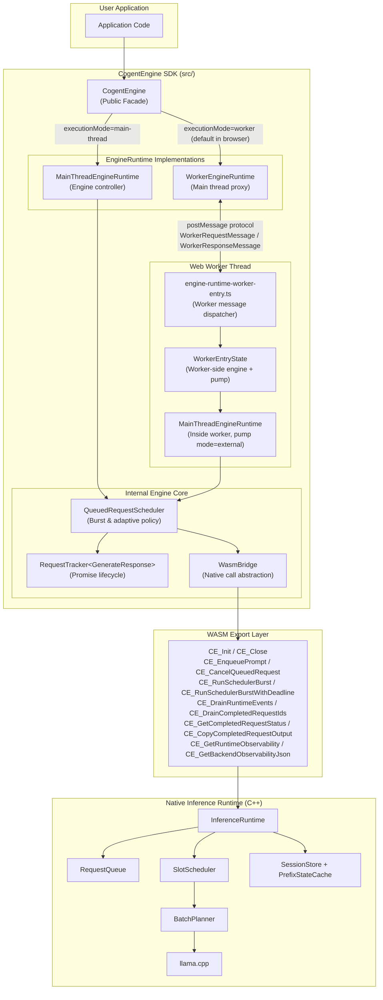

---

## 2. Execution Mode Selection & Initialization

`CogentEngine` selects its runtime backend at construction time based on environment detection. Initialization then proceeds in two distinct phases: **module loading** (fetching & instantiating the WASM binary) and **engine initialization** (calling `CE_Init` with inference configuration).

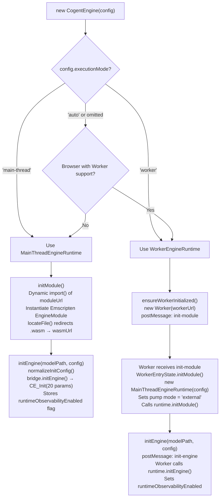

---

## 3. Model Loading

`MainThreadEngineRuntime` delegates all model loading to `MainThreadModelLoader`, which writes the model data into the WASM module's virtual filesystem (MEMFS). Several source types are supported, all transparently writing to OPFS for persistent caching where available. In worker mode, file/stream data is transferred from the main thread to the worker thread via structured ArrayBuffer chunks.

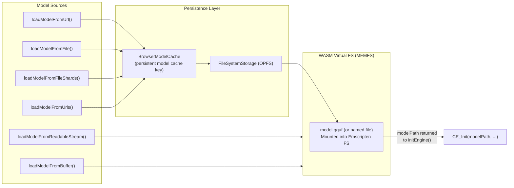

In **worker mode**, `loadModelFromUrl`, `loadModelFromFile`, and `loadModelFromFileShards` send a `load-model-url/file/file-shards` message; `loadModelFromReadableStream` sends chunked `load-model-stream-chunk` messages with backpressure ack (`load-stream-ack`) before the final `load-model-stream-end`. The worker executes the actual download and MEMFS write inside the `WorkerEntryState`.

---

## 4. Request Lifecycle & Execution Call Flow

The execution path has been redesigned around a **burst scheduling model**. Rather than a host-native round-trip per token, the TypeScript scheduler issues a single `CE_RunSchedulerBurst` (or `CE_RunSchedulerBurstWithDeadline`) call that runs many native ticks in one WASM re-entry. Tokens and terminal signals are then batch-collected via `CE_DrainRuntimeEvents`. Requests are tracked entirely in TypeScript through `RequestTracker`; the native side manages the `RequestQueue`.

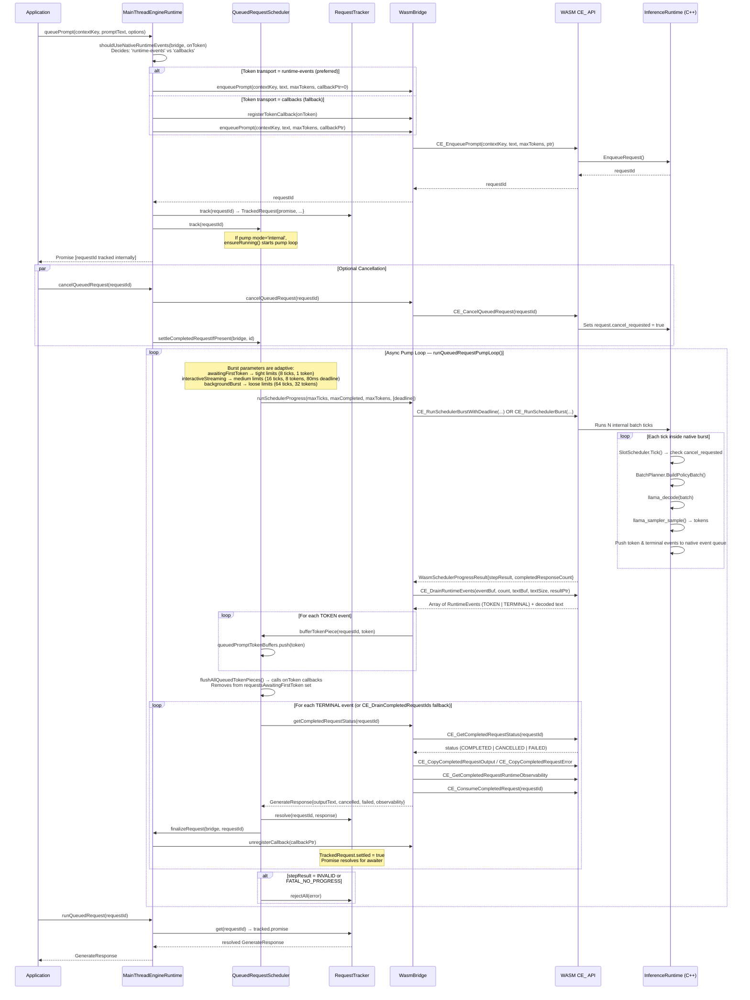

---

## 5. Worker Execution Path & Message Protocol

When using `WorkerEngineRuntime`, all inference execution is offloaded to a dedicated `Worker` thread. The main thread sends typed `WorkerRequestMessage` objects and receives typed `WorkerResponseMessage` objects. Tokens are streamed as `token` messages using a coalescing buffer inside `WorkerEntryState` to minimize cross-thread IPC overhead.

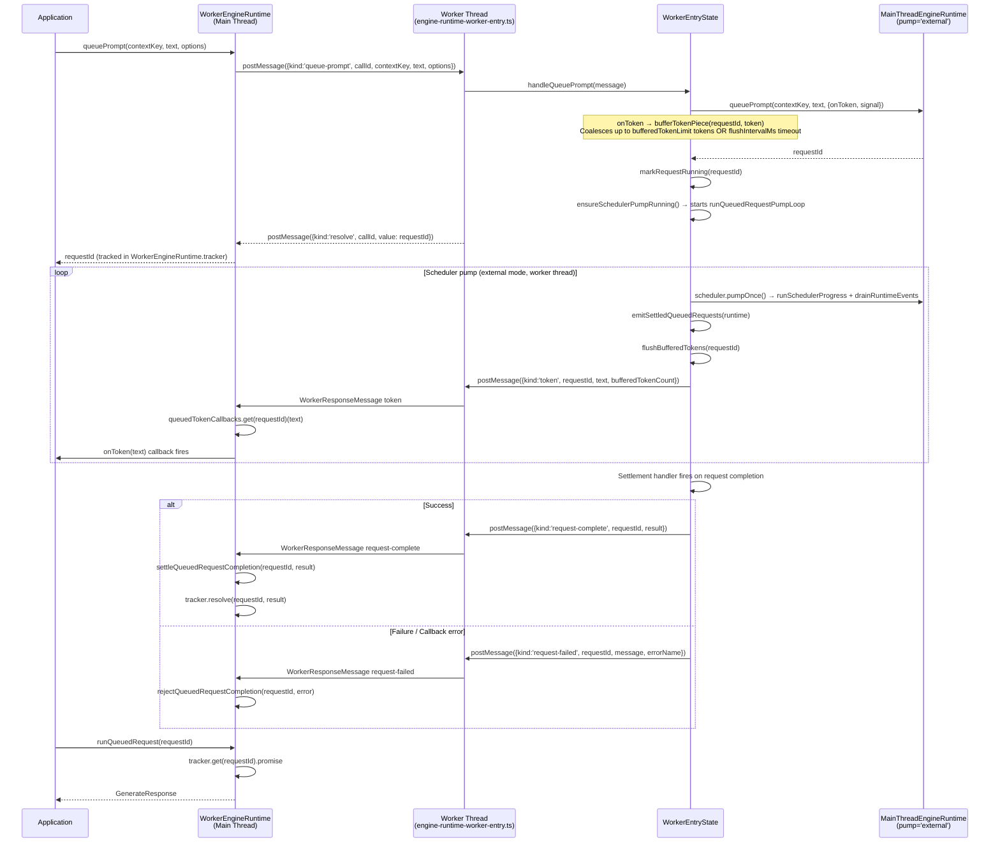

---

## 6. QueuedRequestScheduler — Adaptive Burst Policy

The `QueuedRequestScheduler` controls how aggressively the native burst loop runs each pump step. It maintains two internal sets to classify active requests by their progress state, and uses those sets to select appropriate burst limits:

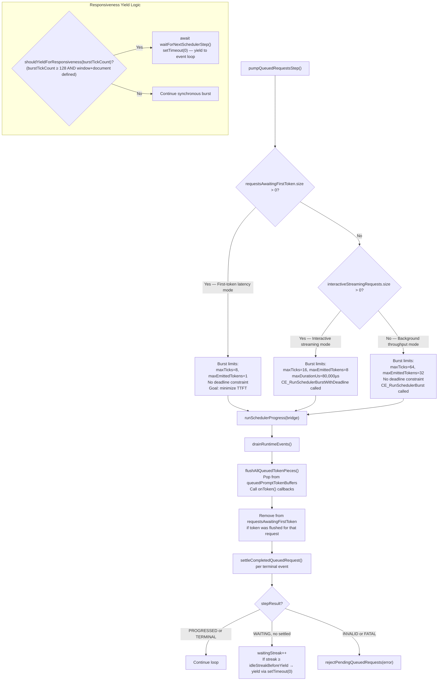

---

## 7. Token Transport Selection

The `MainThreadEngineRuntime` selects the token delivery mechanism per-request at enqueue time. The preferred path is `runtime-events` (zero-allocation batch drain); the fallback is a native C function pointer callback per token.

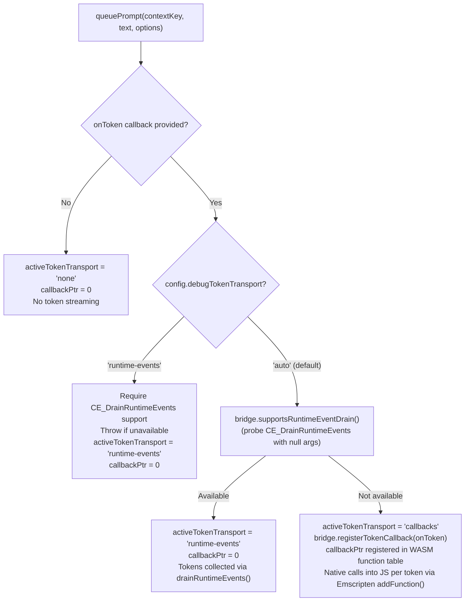

---

## 8. RequestTracker — Promise Lifecycle Management

`RequestTracker<TResult>` is a generic bookkeeping class shared by both `MainThreadEngineRuntime` (tracking `GenerateResponse`) and `WorkerEngineRuntime` (tracking `WorkerRunQueuedRequestResult`). It manages deferred promises, abort signal listeners, and memory cleanup for request completions.

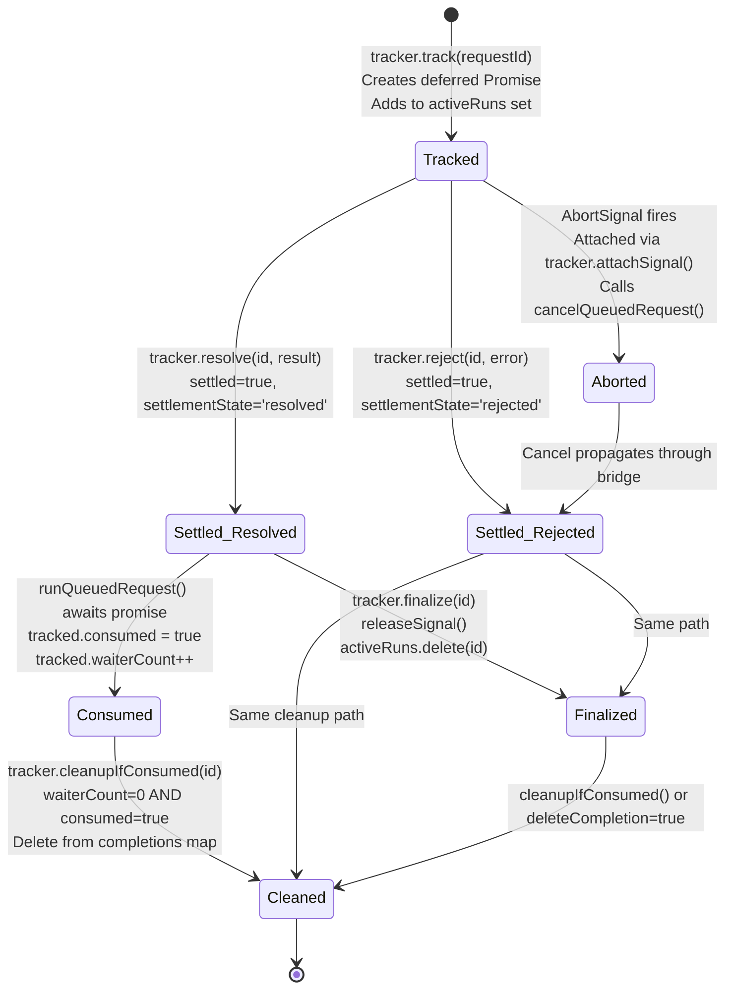

---

## 9. Scheduler & Batching Pipeline

The native `SlotScheduler` multiplexes multiple concurrent requests into a single `llama_batch` per tick. The scheduler policy (configurable at init time via `schedulerPolicy: 'latency-first' | 'balanced' | 'throughput-first'`) controls the relative weight given to prefill vs decode phases in each tick budget.

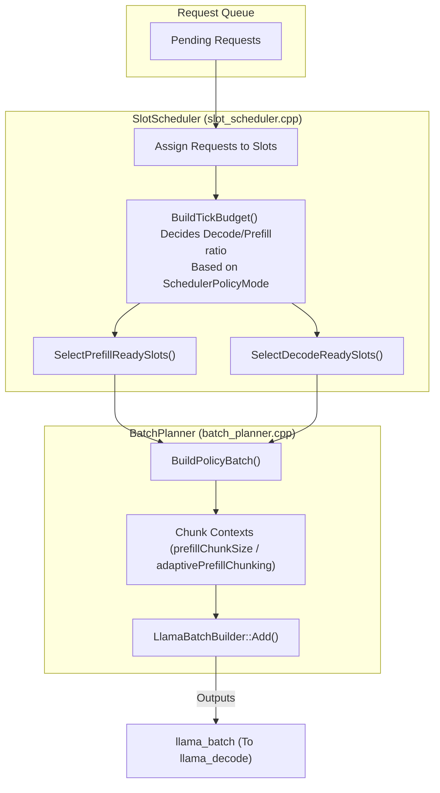

---

## 10. Context Session and Cache Flow

The `SessionStore` manages KV cache reuse across turns. When a slot needs context space (e.g. rotation due to max context length), the runtime attempts to restore previously saved KV state via `llama_kv_cache_seq_cp`, avoiding full re-prefill.

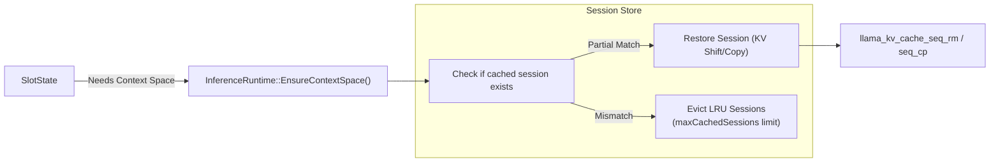

---

## 11. Prefix Caching Architecture

To eliminate redundant prompt computations (such as system prompts or repeated context chunks), the runtime employs a dedicated `PrefixStateCache`. It uses an Exact Hash Bucketing algorithm optimized for `O(1)` memory lookups while remaining token-accurate. The interval granularity is configurable via `prefixCacheIntervalTokens`; the maximum number of stored entries is controlled by `maxPrefixCacheEntries`.

### Exact Lookup and Restore Flow
When a new sequence is requested, the scheduler attempts to locate an exact historical token sequence. Fast retrieval is achieved through hashed candidate lengths combined with a strict full-token equality verification.

### Prefix Cache Store Policy
When a sequence crosses a cacheable interval boundary (dictated by `PrefixCachePolicy` and `prefixCacheIntervalTokens`), the runtime stores the sequence to accelerate future permutations. `retainedPrefixTokens` controls how many leading context tokens are always preserved during eviction.

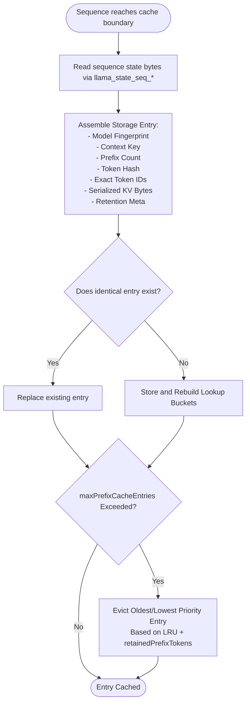

---

## 12. Observability Architecture

CogentEngine exposes three layers of observability, all opt-in:

| Layer | Type | Enabled by |
|---|---|---|
| **RuntimeObservability** | Per-request + aggregate metrics (timing, token counts, cache hits) | `enableRuntimeObservability: true` in `InferenceInitConfig` |
| **BackendObservability** | Raw llama.cpp backend profiling data (JSON) | `enableBackendProfiling: true` in `InferenceInitConfig` |
| **TransportObservability** | Cross-thread token delivery metrics (flush counts, coalescing stats, active transport mode) | Always collected, not gated |

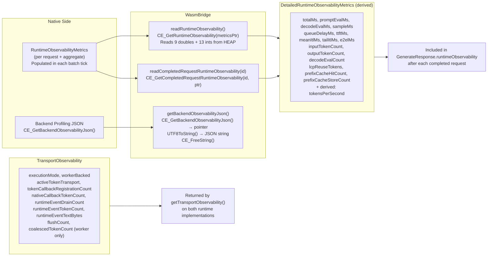
