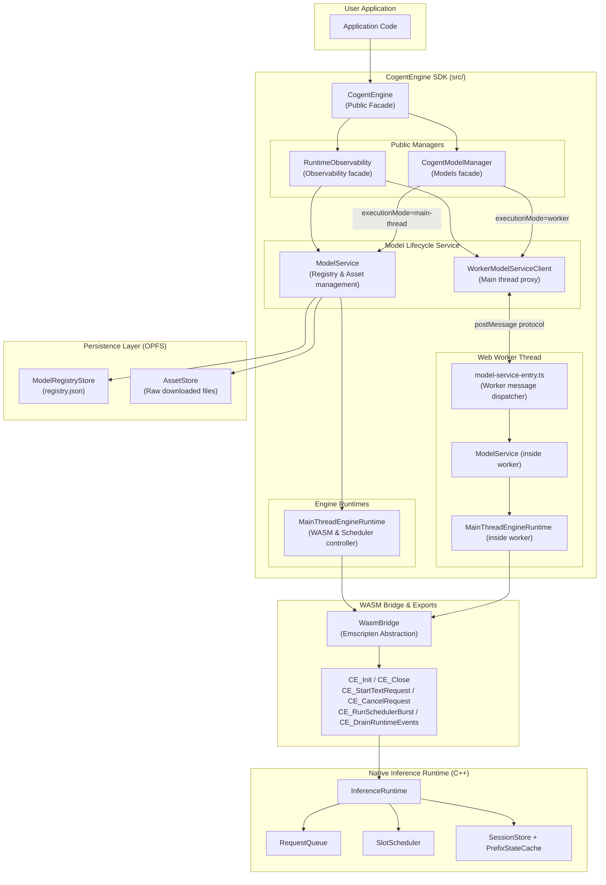
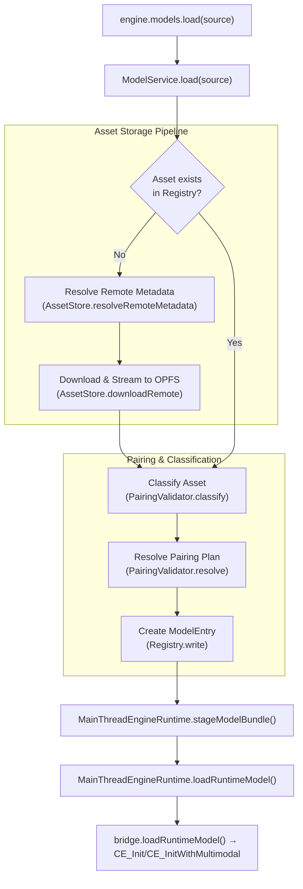
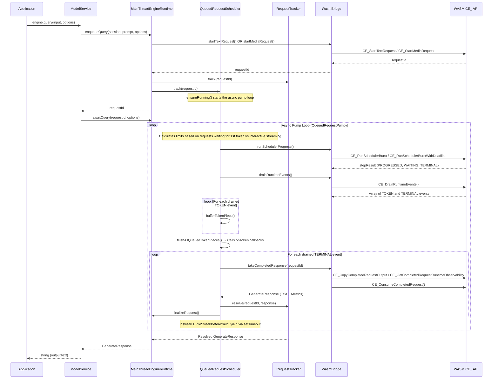
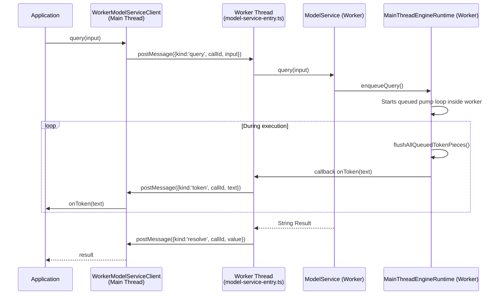
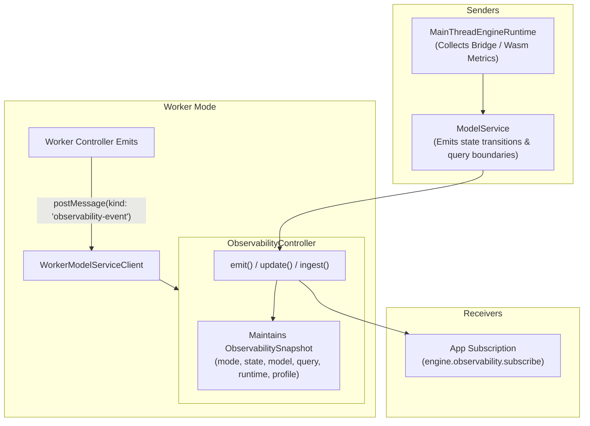
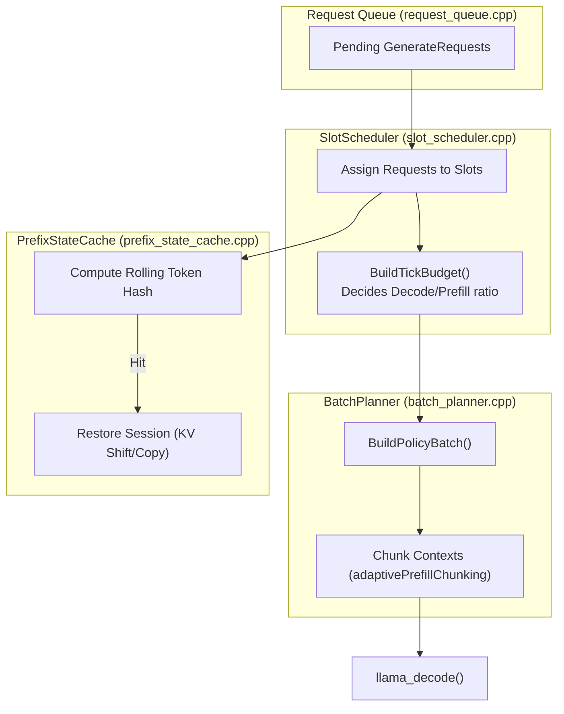

# CogentEngine Codebase Visualization

This document presents a comprehensive set of visualizations for the CogentEngine architecture using Mermaid diagrams. The visualizations are structured from the high-level system boundary down to the nuanced function calls of the native inference scheduler.

---

## 1. High-Level System Architecture

`CogentEngine` is a facade that provides a unified interface for model lifecycle management (`CogentModelManager`), observability, and inference execution. `CogentEngine.create()` selects the underlying implementation based on the environment and configuration. When running in a browser environment with `Worker` support (and no explicit `executionMode` override), it delegates to a `WorkerModelServiceClient`. On Node.js or when `executionMode: 'main-thread'` is set, it uses `ModelService` directly with a `MainThreadEngineRuntime`. Runtime asset URLs are resolved lazily inside the chosen execution context. If callers do not provide explicit `{ moduleUrl, wasmUrl }`, the runtime falls back to the package-bundled assets from inside that context.

All inference-critical logic — WASM module management, native bridge calls, and request tracking — lives inside `MainThreadEngineRuntime`. The worker-backed path instantiates the same runtime class inside a Web Worker, communicates through a structured `postMessage` protocol (defined in `WorkerRequestMessage`/`WorkerResponseMessage`), and exposes the same `ModelLifecycleService` interface.

---

## 2. Model Asset Management & Loading

`ModelService` completely manages model and projector assets. It downloads remote assets, caches them in an OPFS-backed `AssetStore`, and tracks installed models plus projector pairing state in a `ModelRegistryStore`. Installed model ids identify the persisted base-model entry, not a temporary runtime mount. Successful projector pairings are stored on that entry and reused later; unresolved pairing scans are cached against the current projector inventory revision and retried only after the installed projector set changes. The execution path translates a user's `ModelSource` into installed asset records and an internal runtime bundle descriptor before handing it to the runtime. Low-level bundle descriptors, mount paths, queue internals, and native scheduler details are not public API.

In **worker mode**, `WorkerModelServiceClient` proxies `load` via a `models-load` message. The worker performs the fetch, OPFS writes, and `CE_Init` locally. `load-progress` messages are sent back to the main thread to drive UI progress bars.

---

## 3. Request Lifecycle & Burst Scheduling

Execution uses a **native-owned scheduling model** driven by a thin TypeScript browser event-loop pump. The TypeScript `QueuedRequestScheduler` does not own scheduling policy; it only drives the native engine in bounded bursts via `CE_RunSchedulerBurst` (or `CE_RunSchedulerBurstWithDeadline`), drains runtime events, forwards token callbacks, handles aborts, and yields for browser responsiveness.

---

## 4. Worker Execution Path

When `executionMode` is `worker`, all asset processing, OPFS I/O, and inference happen in a background thread.

---

## 5. Observability Subsystem

CogentEngine exposes an opt-in, lifecycle-boundary observability pipeline through `EngineObservability`. This system aggregates timing, throughput, backend profiling, and lifecycle transitions without changing the public `query()` return type.

| Layer | Type | Handled By |
|---|---|---|
| **State Tracking** | Enum states (`idle`, `loading`, `querying`, etc.) | `ObservabilityController` |
| **RuntimeMetrics** | Detailed engine timings (TTFT, ITL, Tokens/sec, prefix cache stats) | Read from `CE_GetRuntimeObservability` memory struct |
| **BackendProfiling** | Raw llama.cpp device profiling JSON | `CE_GetBackendObservabilityJson` |
| **QueryMetrics** | High-level session success/failure timings | Built by `ModelService` during `query()` wrapper |

---

## 6. RequestScheduler & Prefix Caching (Native)

The native side manages `SlotScheduler` (which routes requests to batches) and `PrefixStateCache` (for system prompt or persistent context reuse).

