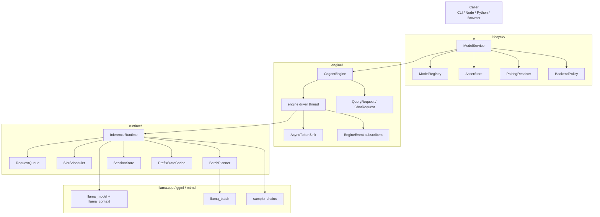
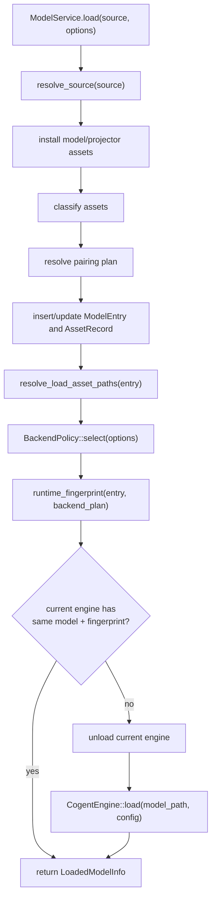
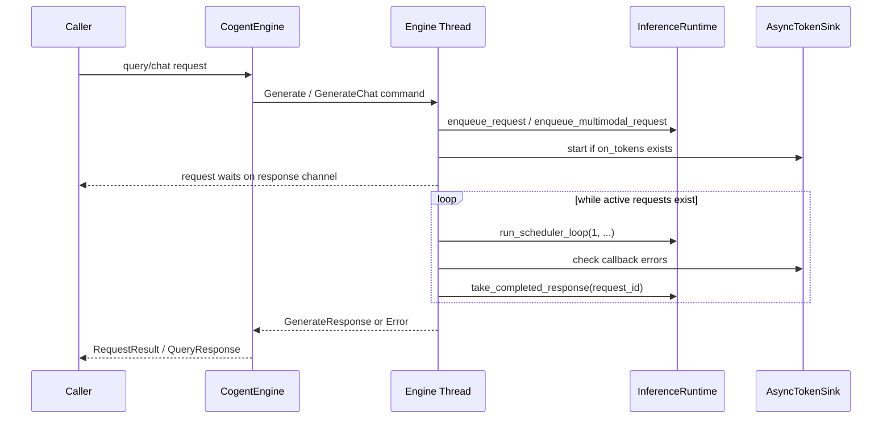
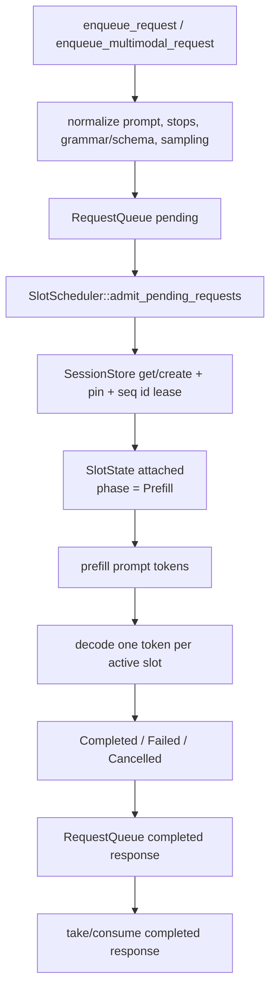
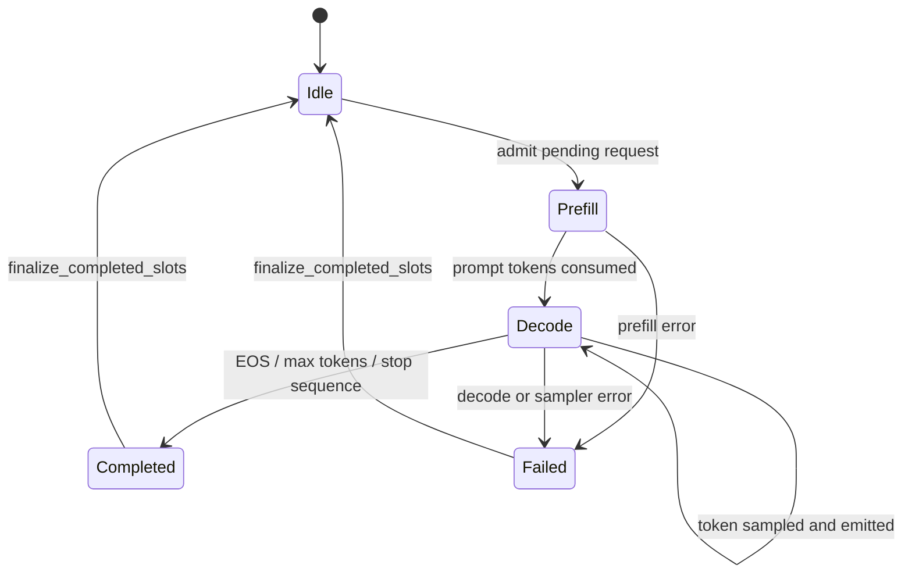
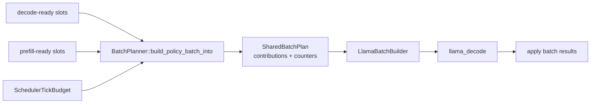

# CogentLM Rust Inference System Design

This document describes the current Rust implementation under
`packages/cogentlm-rs/crates/cogentlm-core`. The browser, Python, Node, and CLI
bindings are thin callers around the same Rust-owned model lifecycle, engine
driver, request queue, scheduler, and llama.cpp runtime.

## 1. Runtime Boundary

The public inference boundary is `ModelService` and `CogentEngine`.

`ModelService` owns lifecycle concerns: registry access, asset installation,
model/projector pairing, backend selection, load/unload, and state projection.
`CogentEngine` owns the execution thread. It loads one `InferenceRuntime`,
accepts query/chat commands over a channel, emits engine events, and returns
`GenerateResponse`/`RequestResult` values to callers.



## 2. Model Lifecycle

Loading starts from a `ModelSource`. The service resolves local or installed
assets into registry records, creates or reuses a `ModelEntry`, selects a
backend plan, resolves concrete asset paths, and loads `CogentEngine`.

The service keeps only one loaded engine at a time. Loading the same model with
the same runtime fingerprint reuses the current engine; loading a different
fingerprint closes the previous engine first.



## 3. Engine Driver

`CogentEngine` is a synchronous handle around a dedicated runtime thread. The
handle sends `EngineThreadCommand` values and waits for responses. The runtime
thread owns all mutable inference state, so callers never share
`InferenceRuntime` directly.

Driver modules are grouped by concern:

| Module | Responsibility |
|---|---|
| `driver/mod.rs` | public engine handle, load/close/query/chat/state APIs |
| `driver/request.rs` | query/chat request types and runtime enqueue path |
| `driver/thread_loop.rs` | command loop and active request stepping |
| `driver/thread_loop/completion.rs` | completion, cancellation, token sink cleanup |
| `driver/token_sink/` | async token callback delivery |
| `driver/stats/` | response/state metric conversion |
| `driver/events.rs` | state/event emission helpers |



## 4. InferenceRuntime State

`InferenceRuntime` owns the native model/context plus all scheduling state:

| Field Group | Purpose |
|---|---|
| native pointers | `common_init`, `primary_model`, `shared_context`, chat templates, mtmd context |
| request state | `RequestQueue`, request ids, completed responses |
| session state | `SessionStore`, per-context KV mirrors, hardware sequence ids |
| scheduling | `SlotScheduler`, `BatchPlanner`, reusable `SharedBatchPlan` and scratch buffers |
| prefix reuse | `PrefixStateCache`, `PrefixCachePolicy`, pending snapshot queue |
| observability | last runtime metrics, per-request debug timings, total token counters |

The runtime loop is intentionally allocation-conscious. It reuses scratch
vectors for decode-ready slots, prefill-ready slots, logits contributions,
terminal sequences, and batch contributions.

## 5. Request Lifecycle

Requests enter through `runtime/inference_runtime/request/`. The API layer
normalizes prompt/options into `GenerateRequest`, assigns a request id, pushes
the request into `RequestQueue`, and optionally creates a token-ring producer
for streaming.



Cancellation is cooperative. The queue marks a request cancelled, the scheduler
continues far enough to cleanly finalize the slot, then the completed response
is reported with `GenerateResponseStatus::Cancelled`.

## 6. Slot Scheduling

`SlotScheduler` is the per-tick slot state coordinator. It keeps the slot list
private and exposes operations grouped by role:

| File | Role |
|---|---|
| `slot_scheduler/flow.rs` | resize, active-slot selection, admission, finalization, token emission |
| `slot_scheduler/budget.rs` | decode/prefill token budget policy |
| `slot_scheduler/metrics.rs` | request-to-runtime observability conversion |
| `slot_scheduler/tests/` | tests grouped by budget, flow, and metrics |

Each slot has one phase: idle, admitted, prefill, decode, completed, or failed.
Admission leases a llama.cpp sequence id, pins the matching session, and attaches
a session snapshot to the slot. Finalization writes the response, releases the
sequence id, unpins/removes the session when needed, and resets the slot.



The scheduler budget supports latency-first, balanced, and throughput-first
policies. Decode tokens are usually prioritized enough to keep active streams
responsive, while prefill receives the remaining capacity.

## 7. Batch Planning

`BatchPlanner` turns selected slots into a flat `SharedBatchPlan`. Decode
contributions are one token per decode-ready slot. Prefill contributions are
round-robin across prefill-ready slots and capped by the tick budget and
configured/adaptive prefill chunk size.



`SharedBatchPlan` owns reusable scratch buffers for active prefill slots,
per-tick offsets, and occupied slot tracking. This avoids per-tick allocation in
the hot path.

## 8. Prefill, Sessions, and Prefix Cache

`SessionStore` maps `context_key` to `SequenceState`. A sequence state mirrors
the current KV tokens, llama.cpp sequence id, hardware id, and pin/eviction
state. Sessions let requests reuse context by computing longest-common-prefix
matches against live KV tokens.

`PrefixStateCache` is a snapshot cache for larger prefix reuse. It stores
llama.cpp state bytes keyed by model fingerprint, context key, token count, and
prefix hash. Lookups return lightweight handles so the runtime can restore large
state buffers without cloning them.

Prefill preparation runs in this order:

1. Compute live LCP reuse from the current session state.
2. Optionally restore a better prefix snapshot.
3. Trim or reset KV state if the model cannot keep partial KV.
4. Reserve context space for missing prompt tokens plus initial decode space.
5. Return cache-hit count and prefill cursor.

Per-step decode also checks context space. For multimodal turns, the runtime
does not evict the multimodal prefix to make room for more decode tokens.

## 9. Streaming

Streaming uses byte rings rather than direct callback execution in the scheduler
hot path. A request with `GenerateTokenEmissionMode::TokenStream` gets a
`TokenByteRingProducer`; sampled token text is appended to the ring as frames.
The engine driver owns an `AsyncTokenSink` per streaming request and delivers
`TokenBatch` values to the caller callback outside the runtime scheduler logic.

If the callback fails, the driver cancels the matching request, consumes its
completion if available, removes the ring producer, closes the token sink, and
emits `RequestFailed`.

## 10. Observability

Runtime observability is opt-in through config. Metrics are accumulated from
request debug timings and runtime totals:

| Metric Area | Source |
|---|---|
| TTFT / E2E / ITL | request timestamps and decode timing |
| input/output/cache/prefill tokens | request counters and runtime totals |
| scheduler timings | per-tick debug metrics in `InferenceRuntime` |
| backend timings | native llama.cpp timing/profiling fields where available |
| engine state | `driver/events.rs` builds `EngineState` from runtime and model state |

Completed request metrics are committed once, then surfaced through the
completed `GenerateResponse` and aggregate runtime observability APIs.

## 11. Module Map

```text
cogentlm-core/src/
  lifecycle/
    service/             model registry/assets/load/unload facade
    types/               lifecycle DTOs and errors
  engine/
    driver/              public engine handle and runtime thread
    protocol.rs          engine state/event/result DTOs
    stream.rs            streaming token batches
  runtime/
    inference_runtime/   llama.cpp runtime state machine
    request/             request queue, request/response types, token rings
    scheduler/           slots and batch planning
    session/             live sessions and prefix snapshot cache
    llama/               llama batch builder
```

The important ownership rule is simple: `ModelService` owns loaded-engine
lifecycle, `CogentEngine` owns the runtime thread, and `InferenceRuntime` owns
all mutable native inference state.
